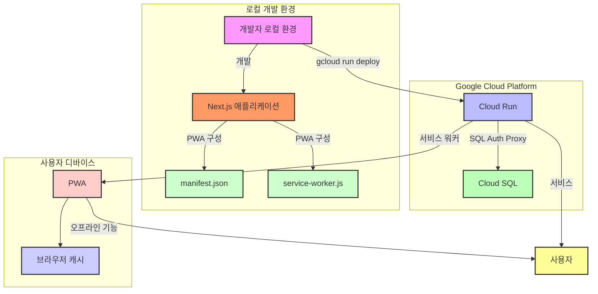

```
🔧 기존의 구글 클라우드 RUN 배포를 레거시 처리 및 실제 데모를 위한 배포 환경 구성 중
```

## 📓 프로젝트 명

- **nagging (잔소리)**
  

## 👁‍🗨 프로젝트 개요

- 애드센스 광고수익 추적 및 관리를 간편하게 하기 위한 일/월/년 단위 자동 합산과 사용자 맞춤형 보고서 메일링(알림) 서비스 입니다. 기존 서비스의 직관적이지 못하고 복잡함을 개선하여 보다 일반 사용자가 직접적으로 필요한 정보만을 확인하여 활용할 수 있도록 사용자 친화적인 환경을 구축하는 것을 목표로 진행되었습니다.

## 📅 개발 기간/유지보수

- **개발기간**: 2024.07.09 ~ 2024.08.05
- **유지보수**: -
- **히스토리**: [작업 이슈 히스토리](https://github.com/youngwan2/nagging/issues/2)

## 🔥 배포

### 도메인 주소

- https://nagging.site (중단/변경 예정)
- 테스트 배포(데모): https://port-next-nagging-m59c3x7u39153c8e.sel4.cloudtype.app

## 배포 아키텍처

<details>
  <summary>이전 배포 아키텍처(mermaid)</summary>



</details>

## 🧰 프레임워크 / 라이브러리 / 그 외 도구

### 언어/프레임워크/라이브러리

|   사용 스텍    | 비고                                                                            |
| :------------: | :------------------------------------------------------------------------------ |
| NextJS(15.1.2) | 기존 react의 고질적인 문제인 SEO 문제의 개선과 RSC 를 통한 빠른 서버 데이터처리 |
| Typescript(^5) | 타입 추론 및 정적 타입 체크                                                     |

### 상태관리

|           사용 스텍            | 비고                                                                          |
| :----------------------------: | :---------------------------------------------------------------------------- |
|        Zustand (^4.5.4)        | 클라이언트 전역 상태 관리                                                     |
| tanstack/react-query (^5.51.1) | 클라이언트와 서버 로직 간 의존성 분리 및 중복 요청 캐싱, 구조화된 데이터 처리 |

### 데이터베이스

|      사용 스텍      | 비고                         |
| :-----------------: | :--------------------------- |
| PostgreSQL + Prisma | 애드센스 데이터 저장 및 관리 |

### 그 외

|         사용 스텍          | 비고                                                                                          |
| :------------------------: | :-------------------------------------------------------------------------------------------- |
| next-auth (^5.0.0-beta.19) | 구글 소셜 로그인                                                                              |
|     node-cron (^3.0.3)     | 로컬 보고서 알림 자동화를 위한 스케줄 등록                                                    |
|          next-pwa          | 모바일에서도 캐싱 기능을 통해 오프라인 접속 및 빠른 렌더링을 통한 부드러운 사용자 경험을 제공 |
|       Vitest(^2.1.8)       | 주요 로직 단위 테스트 용도                                                                    |
|        msw(^2.7.0)         | HTTP 모의 요청 용도                                                                           |

## ⚙ 서비스

### 환율 정보/간편 통계

#### 국가별 시계열 환율 차트

- 애드센스 수익을 환전하기 전에 바꾸기 적정한 시기인지 확인할 수 있도록 추가된 시계열 점선 그래프 입니다. 주요 국가별로 필터링할 수 있습니다.
  

- 주요 50개 국에 대한 당일 환율 정보도 표 형태로 바로 확인할 수 있습니다.
  

#### 간편 통계

- 현재 사용자가 애드센스 광고 수익을 대략적으로 얼마나 환전할 수 있는지 시각적으로 확인할 수 있도록 합니다. 조회된 통계 결과는 CSV 로 간편하게 다운로드 할 수 있도록 추가적인 기능을 제공하고 있습니다.
  

### 보고서/알림

#### 보고서 작성 및 등록

- 사용자가 필요한 애드센스 수익 통계와 관련한 맞춤형 보고서를 작성할 수 있도록 합니다. 기존 애드센스의 경우 이러한 기능을 사용하기 직관적이지 못해서 불편했기에 한 눈에 확인할 수 있도록 UI 와 레이아웃을 디자인 및 설정 하였습니다.
  

#### 알림 설정

- 사용자는 추가한 보고서를 기반으로 SMTP 를 통해 통계 데이터를 csv 파일 형태로 받을 수 있습니다. 현재는 1년, 1달, 1주, 즉시 받기 4가지 알림 설정이 가능합니다.
  

- 만일 사용자가 등록한 일정이 되면, 구글 소셜 로그인 계정의 이메일로 아래 메시지와 첨부파일(csv)를 확인할 수 있습니다.
  

## 🗂️ 프로젝트 구조

```
📦src
 ┣ 📂actions -------------------------------------------> 서버 액션
 ┣ 📂app -----------------------------------------------> 페이지
 ┃ ┣ 📂(policy) -------------> 이용약관, 개인정보처리방침
 ┃ ┃ ┣ 📂privacy-policy
 ┃ ┃ ┗ 📂terms-of-service
 ┃ ┣ 📂api  ----------------> API Route
 ┃ ┃ ┣ 📂adsense
 ┃ ┃ ┃ ┣ 📂payments
 ┃ ┃ ┃ ┗ 📂reports
 ┃ ┃ ┣ 📂auth
 ┃ ┃ ┃ ┗ 📂[...nextauth]
 ┃ ┃ ┗ 📂notification
 ┃ ┃ ┃ ┣ 📂reports
 ┃ ┃ ┃ ┃ ┣ 📂[reportId]
 ┃ ┃ ┃ ┣ 📂schedules
 ┃ ┃ ┃ ┗ 📂tasks
 ┃ ┃ ┃ ┃ ┣ 📂sync-task
 ┃ ┃ ┃ ┃ ┗ 📂[reportId]
 ┃ ┣ 📂auth
 ┃ ┃ ┗ 📂signin
 ┃ ┣ 📂dashboard
 ┃ ┃ ┣ 📂anlaytics
 ┃ ┃ ┣ 📂info
 ┃ ┃ ┣ 📂notification-settings
 ┣ 📂components --------------------------------------> 컴포넌트
 ┃ ┣ 📂auth
 ┃ ┣ 📂section
 ┃ ┣ 📂ui
 ┃ ┃ ┣ 📂button
 ┃ ┃ ┣ 📂card
 ┃ ┃ ┣ 📂container
 ┃ ┃ ┣ 📂form
 ┃ ┃ ┣ 📂graph
 ┃ ┃ ┣ 📂heading
 ┃ ┃ ┣ 📂icon
 ┃ ┃ ┣ 📂Input
 ┃ ┃ ┣ 📂item
 ┃ ┃ ┣ 📂label
 ┃ ┃ ┣ 📂layout
 ┃ ┃ ┣ 📂list
 ┃ ┃ ┣ 📂message
 ┃ ┃ ┣ 📂option
 ┃ ┃ ┣ 📂pagination
 ┃ ┃ ┣ 📂select
 ┃ ┃ ┣ 📂skeleton
 ┃ ┃ ┣ 📂spinner
 ┃ ┃ ┣ 📂table
 ┃ ┃ ┣ 📂text
 ┃ ┃ ┗ 📂wrapper
 ┃ ┣ 📂__test__
 ┣ 📂configs ---------------------> 구성파일
 ┣ 📂constants -------------------> 상수
 ┣ 📂hooks -----------------------> 커스텀 훅
 ┃ ┣ 📂__test__
 ┣ 📂mocks -------------------------> 테스트 전용 목 데이터, 목 서버 등 설정 파일
 ┣ 📂services ---------------------> API
 ┣ 📂store ------------------------> Zustand
 ┃ ┣ 📂types
 ┣ 📂types
 ┣ 📂utils ------------------------> 유틸
 ┃ ┣ 📂__test__
```
