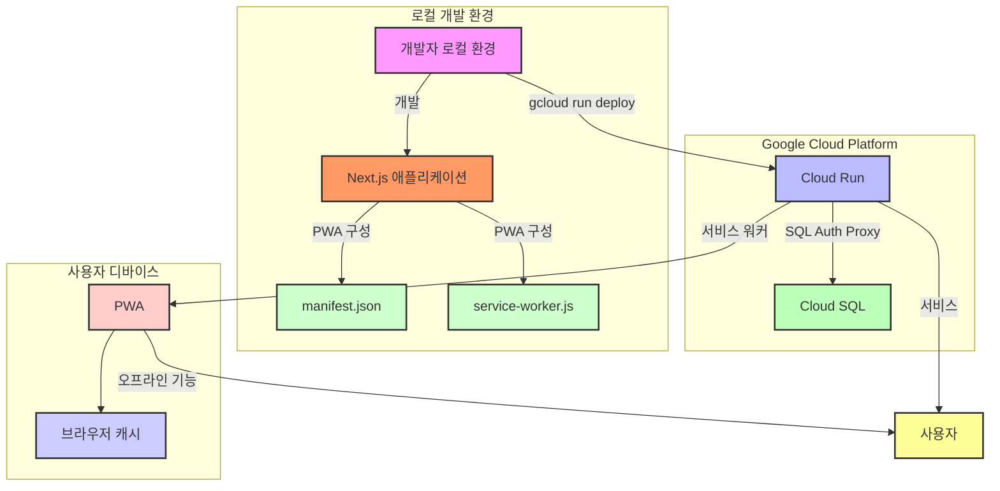

```
🔧 기존의 구글 클라우드 RUN 배포를 레거시 처리 및 실제 데모를 위한 배포 환경 구성 중
```

## 📓 프로젝트 명

- **nagging (잔소리)**


## 👁‍🗨 프로젝트 개요

- 애드센스 광고수익 추적 및 관리를 간편하게 하기 위한 일/월/년 단위 자동 합산과 사용자 맞춤형 보고서 메일링(알림) 서비스 입니다.

## 🎫 프로젝트 목적과 방향성

- **(목적)** 기존 애드센스 보고서처리는 사용자가 직접 애드센스 페이지에 방문하여 수동으로 처리해야 했습니다. 해당 프로젝트는 이러한 불편함을 개선하는 것이 목적이며, 애드센스 수익 계산 처리 및 보고서 알림 자동화를 통해 사용자는 기존의 애드센스 보고서의 복잡함을 단순화하여 편의성과 접근성을 높이는 것을 목표로 합니다.
- **(방향성)** 현재는 애드센스 보고서 등록 및 알림 자동화에 초점을 두는 만큼 모든 옵션을 제공하고 있지 않으나, 조금씩 기능이 안정화되면 수익관리에 필요한 몇 가지 옵션을 계속해서 추가해 나갈 예정입니다.

## 📅 개발 기간/유지보수

- **개발기간**: 2024.07.09 ~ 2024.08.05
- **유지보수**: -
- **히스토리**: [작업 이슈 히스토리](https://github.com/youngwan2/nagging/issues/2)

## 🔥 배포

### 도메인 주소

- https://nagging.site (중단/변경 예정)

## 배포 아키텍처

<details>
  <summary>이전 배포 아키텍처(mermaid)</summary>



</details>

## 🧰 프레임워크 / 라이브러리 / 그 외 도구

### 언어/프레임워크/라이브러리

|   사용 스텍    | 비고                                                                            |
| :------------: | :------------------------------------------------------------------------------ |
| NextJS(15.1.2) | 기존 react의 고질적인 문제인 SEO 문제의 개선과 RSC 를 통한 빠른 서버 데이터처리 |
| Typescript(^5) | 타입 추론 및 정적 타입 체크                                                     |

### 상태관리

|           사용 스텍            | 비고                                                                          |
| :----------------------------: | :---------------------------------------------------------------------------- |
|        Zustand (^4.5.4)        | 클라이언트 전역 상태 관리                                                     |
| tanstack/react-query (^5.51.1) | 클라이언트와 서버 로직 간 의존성 분리 및 중복 요청 캐싱, 구조화된 데이터 처리 |

### 데이터베이스

|      사용 스텍      | 비고                         |
| :-----------------: | :--------------------------- |
| PostgreSQL + Prisma | 애드센스 데이터 저장 및 관리 |

### 그 외

|         사용 스텍          | 비고                                                                                          |
| :------------------------: | :-------------------------------------------------------------------------------------------- |
| next-auth (^5.0.0-beta.19) | 구글 소셜 로그인                                                                              |
|     node-cron (^3.0.3)     | 로컬 보고서 알림 자동화를 위한 스케줄 등록                                                    |
|          next-pwa          | 모바일에서도 캐싱 기능을 통해 오프라인 접속 및 빠른 렌더링을 통한 부드러운 사용자 경험을 제공 |
|       Vitest(^2.1.8)       | 주요 로직 단위 테스트 용도                                                                    |
|        msw(^2.7.0)         | HTTP 모의 요청 용도                                                                           |

## 🤔 트러블 슈팅

- [트러블 슈팅](https://duklook.tistory.com/595)

## ⚙ 핵심 기능

### 보고서 기능(알림 설정)

- 사용자가 애드센스 수익 통계를 위한 보고서 옵션을 선택하고, 원하는 시간대에 맞춰 CSV 형식의 보고서를 받을 수 있습니다. 이 기능은 사용자가 맞춤형 데이터를 얻을 수 있도록 도와주는데 목적이 있습니다.

#### 사용방법

- **보고서 옵션 선택**: 사용자는 제공되는 여러 보고서 옵션 중에서 원하는 항목을 선택할 수 있습니다. 옵션은 [예: 날짜 범위, 데이터 범위, 화폐 단위 등]을 포함합니다. 선택 후에는 [보고서 등록] 을 클릭합니다.


- **보고서 옵션 목록**: 보고서 등록을 마치면, 보고서 옵션에 대한 요약과 이에 대한 알림 설정 등을 할 수 있는 목록이 생성 됩니다. [주단위, 월단위, 년단위] 선택이 가능하며, 즉시 받아보고자 한다면 [즉시 받기] 를 클릭하면, 구글 이메일 계정으로 애드센스 보고서가 생성되어 전송됩니다.


- 해당 계정의 이메일(지메일)로 가시면 해당 문구가 표시되며, 하단에 CSV 포맷의 파일을 다운로드 할 수 있습니다.


- **알림 관리**: 앞서 보고서 옵션 목록에서 주단위, 월단위, 년단위 중 하나를 선택 하였다면 알림 관리 목록에서 해당 알림에 대한 일정을 요약한 아이템이 생성 됩니다.
  - 다음 알림과 다다음 알림을 매번 추적하여 일정을 표시합니다.


## 개선사항

- 크론 동기화
  - 현재 인스턴스 내부에서 node-cron 을 통해 알람 기능을 활성화 중이지만, 도커 인스턴스가 중지된 상태에서는 크론이 비활성화되고 있으므로, 이를 GCP의 스케줄러 api 와 연동해서 주기적으로 인스턴스 내 크론 작업을 동기화할 수 있도록 개선할 예정입니다. 즉, 인스턴스가 중지된 상태라 해도, 사용자가 등록한 크론 작업(스케줄)이 지정한 타이밍에 정상적으로 실행될 수 있도록 개선하고자 합니다.

## 🗂️ 프로젝트 구조

```
📦src
 ┣ 📂actions -------------------------------------------> 서버 액션
 ┣ 📂app -----------------------------------------------> 페이지
 ┃ ┣ 📂(policy) -------------> 이용약관, 개인정보처리방침
 ┃ ┃ ┣ 📂privacy-policy
 ┃ ┃ ┗ 📂terms-of-service
 ┃ ┣ 📂api  ----------------> API Route
 ┃ ┃ ┣ 📂adsense
 ┃ ┃ ┃ ┣ 📂payments
 ┃ ┃ ┃ ┗ 📂reports
 ┃ ┃ ┣ 📂auth
 ┃ ┃ ┃ ┗ 📂[...nextauth]
 ┃ ┃ ┗ 📂notification
 ┃ ┃ ┃ ┣ 📂reports
 ┃ ┃ ┃ ┃ ┣ 📂[reportId]
 ┃ ┃ ┃ ┣ 📂schedules
 ┃ ┃ ┃ ┗ 📂tasks
 ┃ ┃ ┃ ┃ ┣ 📂sync-task
 ┃ ┃ ┃ ┃ ┗ 📂[reportId]
 ┃ ┣ 📂auth
 ┃ ┃ ┗ 📂signin
 ┃ ┣ 📂dashboard
 ┃ ┃ ┣ 📂anlaytics
 ┃ ┃ ┣ 📂info
 ┃ ┃ ┣ 📂notification-settings
 ┣ 📂components --------------------------------------> 컴포넌트
 ┃ ┣ 📂auth
 ┃ ┣ 📂section
 ┃ ┣ 📂ui
 ┃ ┃ ┣ 📂button
 ┃ ┃ ┣ 📂card
 ┃ ┃ ┣ 📂container
 ┃ ┃ ┣ 📂form
 ┃ ┃ ┣ 📂graph
 ┃ ┃ ┣ 📂heading
 ┃ ┃ ┣ 📂icon
 ┃ ┃ ┣ 📂Input
 ┃ ┃ ┣ 📂item
 ┃ ┃ ┣ 📂label
 ┃ ┃ ┣ 📂layout
 ┃ ┃ ┣ 📂list
 ┃ ┃ ┣ 📂message
 ┃ ┃ ┣ 📂option
 ┃ ┃ ┣ 📂pagination
 ┃ ┃ ┣ 📂select
 ┃ ┃ ┣ 📂skeleton
 ┃ ┃ ┣ 📂spinner
 ┃ ┃ ┣ 📂table
 ┃ ┃ ┣ 📂text
 ┃ ┃ ┗ 📂wrapper
 ┃ ┣ 📂__test__
 ┣ 📂configs ---------------------> 구성파일
 ┣ 📂constants -------------------> 상수
 ┣ 📂hooks -----------------------> 커스텀 훅
 ┃ ┣ 📂__test__
 ┣ 📂mocks -------------------------> 테스트 전용 목 데이터, 목 서버 등 설정 파일
 ┣ 📂services ---------------------> API
 ┣ 📂store ------------------------> Zustand
 ┃ ┣ 📂types
 ┣ 📂types
 ┣ 📂utils ------------------------> 유틸
 ┃ ┣ 📂__test__
```
