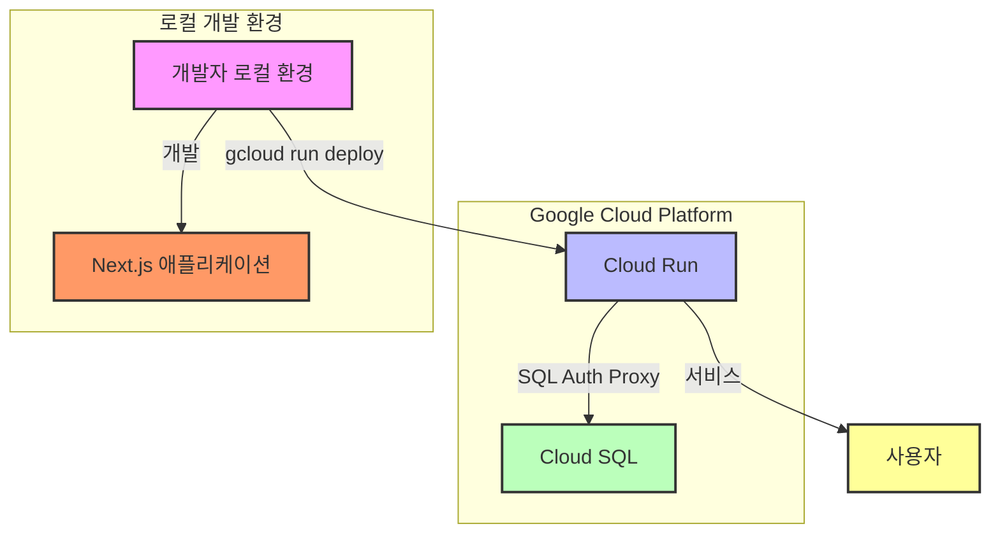

## 📓 프로젝트 명
- **nagging (잔소리)**:
  잔소리 작명 이유는 수익 통계 알림을 자동화하는 것이라 돈소리가 나는 것 같다는 생각 + 매번 정해진 일정 마다 같은 동작을 반복하는 것이 꼭 잔소리를 듣는 것 같다는 중의적 의미을 담아 잔소리(Nagging)라 이름 지었습니다.


## 👁‍🗨 프로젝트 개요

- 애드센스 광고수익 추적 및 관리를 간편하게 하기 위한 일/월/년 단위 자동 합산과 사용자 맞춤형 보고서 메일링(알림) 서비스 입니다.

## 🎫 프로젝트 목적과 방향성

- **(목적)** 기존 애드센스 보고서처리는 사용자가 직접 애드센스 페이지에 방문하여 수동으로 처리해야 했습니다. 해당 프로젝트는 이러한 불편함을 개선하는 것이 목적이며, 애드센스 수익 계산 처리 및 보고서 알림 자동화를 통해 사용자는 기존의 애드센스 보고서의 복잡함을 단순화하여 편의성과 접근성을 높이는 것을 목표로 합니다.
- **(방향성)** 현재는 애드센스 보고서 등록 및 알림 자동화에 초점을 두는 만큼 모든 옵션을 제공하고 있지 않으나, 조금씩 기능이 안정화되면 수익관리에 필요한 몇 가지 옵션을 계속해서 추가해 나갈 예정입니다.

## 📅 개발 기간/유지보수

- **개발기간**: 2024.07.09 ~ 2024.08.05
- **유지보수**: -
- **히스토리**: [작업 이슈 히스토리](https://github.com/youngwan2/nagging/issues/2)

## 🔥 배포
### 참고할 점(24.08.23)
-  Cloud Run의 경우 사용하지 않는 컨테이너 인스턴스가 0 이 되도록 설정해 두었습니다. 활성화된 인스턴스가 0 인 상태에서 접속 시 부팅되는 시간동안 지연 시간이 발생하는 콜드 스타트 문제로 사이트 접속이 일정시간 지연될 수 있습니다.
-  현재 사이트는 GCP의 Cloud 스케줄러 등이 적용 전인 상태이므로, 보고서 설정 후 사용이 제한되는 문제가 있습니다.
-  스케줄 목록과 보고서 등록 이후 추가된 항목이 즉시 렌더링되지 않는 문제가 있어서 해당 문제를 개선하고, 곧 반영할 예정입니다.
-  현재 08.23 기준으로 로컬에서 변경된 부분이 반영되어 있지 않습니다(ex. 폰트 변경.
  
### 도메인 주소
- https://nagging.site

## 배포 아키텍처
- 다크모드에서는 흐릿하게 보일 수 있습니다.


## 🧰 프레임워크 / 라이브러리 / 그 외 도구

### 언어/프레임워크/라이브러리

|   사용 스텍    | 비고                                                                                                                          |
| :------------: | :---------------------------------------------------------------------------------------------------------------------------- |
| NextJS(14.2.4) | 기존 react의 고질적인 문제인 SEO 문제의 개선과 RSC 를 통한 빠른 서버 데이터처리 |
| Typescript(^5) | 타입 추론 및 정적 타입 체크                                                                          |

### 상태관리

|           사용 스텍            | 비고                                                                          |
| :----------------------------: | :---------------------------------------------------------------------------- |
|        Zustand (^4.5.4)        | 클라이언트 전역 상태 관리                                                     |
| tanstack/react-query (^5.51.1) | 클라이언트와 서버 로직 간 의존성 분리 및 중복 요청 캐싱, 구조화된 데이터 처리 |

### 데이터베이스

|      사용 스텍      | 비고 |
| :-----------------: | :--- |
| PostgreSQL + Prisma + GCP Cloud SQL | -    |

### 그 외

|         사용 스텍          | 비고                                  |
| :------------------------: | :------------------------------------ |
| next-auth (^5.0.0-beta.19) | 구글 소셜 로그인                      |
|     node-cron (^3.0.3)     | 로컬 보고서 알림 자동화를 위한 스케줄 등록 |

### 배포
|         사용 스텍          | 비고                                  |
| :------------------------: | :------------------------------------ |
| GCP Cloud Run |도커 컨테이너 배포( 유연한 인스턴스 자동확장 및 축소, 로컬 환경과 사실상 거의 동일한 환경에서 코드를 실행할 수 있는 이점이 돋보임)            |

## 🤔 트러블 슈팅
- [트러블 슈팅](https://duklook.tistory.com/595)

## ⚙ 주요 기능

### 보고서 기능(알림 설정)

- 사용자가 애드센스 수익 통계를 위한 보고서 옵션을 선택하고, 원하는 시간대에 맞춰 CSV 형식의 보고서를 받을 수 있습니다. 이 기능은 사용자가 맞춤형 데이터를 얻을 수 있도록 도와주는데 목적이 있습니다.

#### 기능 설명

- **보고서 옵션 선택**: 사용자는 제공되는 여러 보고서 옵션 중에서 원하는 항목을 선택할 수 있습니다. 옵션은 [예: 날짜 범위, 데이터 범위, 화폐 단위 등]을 포함합니다.
- **알림 등록 및 CSV 파일 전송**: 설정된 날짜와 보고서 형식에 맞춰 사용자가 주/월/년 단위로 알림을 등록하면, 해당 일정에 맞춰 CSV 보고서가 자동으로 생성되어 로그인한 구글의 이메일 주소 전송됩니다.
- **보고서 및 알림 관리**:
  - 사용자는 하나의 페이지에서 보고서 추가 및 목록 관리, 알림 등록, 알림 삭제 등의 처리가 가능합니다. 등록된 알림의 경우에는 다음과 다다음 알림 일정을 확인할 수 있으므로, 사용자는 자신이 요청한 보고서가 언제 받아볼 수 있는지 실시간으로 확인할 수 있습니다.

#### 사용 방법

- **보고서 옵션 선택**:
  - 웹 애플리케이션 또는 API를 통해 제공되는 옵션 목록에서 원하는 보고서 옵션을 선택합니다.
  - 예를 들어, '날짜 범위'를 설정하고, 필요한 데이터 필터를 적용합니다.
- **보고서 전송 시간**:
  - 보고서가 전송될 시간을 선택합니다. 현재는 주/월/년 단위로 알림 설정이 가능합니다.
- **보고서 즉시 요청**:
  - '즉시 받기' 버튼을 클릭하면 설정한 옵션에 따른 맞춤형 보고서가 사용자의 계정 이메일로 전송됩니다.

## 개선사항
- 크론 동기화
   - 현재 인스턴스 내부에서 node-cron 을 통해 알람 기능을 활성화 중이지만, 도커 인스턴스가 중지된 상태에서는 크론이 비활성화되고 있으므로, 이를 GCP의 스케줄러 api 와 연동해서 주기적으로 인스턴스 내 크론 작업을 동기화할 수 있도록 개선할 예정입니다. 즉, 인스턴스가 중지된 상태라 해도, 사용자가 등록한 크론 작업(스케줄)이 지정한 타이밍에 정상적으로 실행될 수 있도록 개선하고자 합니다.


## 🗂️ 프로젝트 구조

```
📦src
 ┣ 📂actions -------------------------------------------> 서버 액션
 ┃ ┣ 📜adsense-actions.ts
 ┃ ┗ 📜notification-actions.ts
 ┣ 📂app -----------------------------------------------> 페이지
 ┃ ┣ 📂(policy) -------------> 이용약관, 개인정보처리방침
 ┃ ┃ ┣ 📂privacy-policy
 ┃ ┃ ┃ ┗ 📜page.tsx
 ┃ ┃ ┗ 📂terms-of-service
 ┃ ┃ ┃ ┗ 📜page.tsx
 ┃ ┣ 📂api  ----------------> API Route
 ┃ ┃ ┣ 📂adsense
 ┃ ┃ ┃ ┣ 📂payments
 ┃ ┃ ┃ ┃ ┗ 📜route.ts
 ┃ ┃ ┃ ┗ 📂reports
 ┃ ┃ ┃ ┃ ┗ 📜route.ts
 ┃ ┃ ┣ 📂auth
 ┃ ┃ ┃ ┗ 📂[...nextauth]
 ┃ ┃ ┃ ┃ ┗ 📜route.ts
 ┃ ┃ ┗ 📂notification
 ┃ ┃ ┃ ┣ 📂reports
 ┃ ┃ ┃ ┃ ┣ 📂[reportId]
 ┃ ┃ ┃ ┃ ┃ ┗ 📜route.ts
 ┃ ┃ ┃ ┃ ┗ 📜route.ts
 ┃ ┃ ┃ ┣ 📂schedules
 ┃ ┃ ┃ ┃ ┗ 📜route.ts
 ┃ ┃ ┃ ┗ 📂tasks
 ┃ ┃ ┃ ┃ ┣ 📂sync-task
 ┃ ┃ ┃ ┃ ┃ ┗ 📜route.ts
 ┃ ┃ ┃ ┃ ┗ 📂[reportId]
 ┃ ┃ ┃ ┃ ┃ ┗ 📜route.ts
 ┃ ┣ 📂auth
 ┃ ┃ ┗ 📂signin
 ┃ ┃ ┃ ┗ 📜page.tsx
 ┃ ┣ 📂dashboard
 ┃ ┃ ┣ 📂anlaytics
 ┃ ┃ ┃ ┗ 📜page.tsx
 ┃ ┃ ┣ 📂info
 ┃ ┃ ┃ ┗ 📜page.tsx
 ┃ ┃ ┣ 📂notification-settings
 ┃ ┃ ┃ ┗ 📜page.tsx
 ┃ ┃ ┣ 📜loading.tsx
 ┃ ┃ ┗ 📜page.tsx
 ┃ ┣ 📜error.tsx
 ┃ ┣ 📜favicon.ico
 ┃ ┣ 📜globals.css
 ┃ ┣ 📜layout.tsx
 ┃ ┣ 📜loading.tsx
 ┃ ┣ 📜manifest.json
 ┃ ┣ 📜not-found.tsx
 ┃ ┗ 📜page.tsx
 ┣ 📂components --------------------------------------> 컴포넌트
 ┃ ┣ 📂auth
 ┃ ┃ ┗ 📜SignOutIcon.tsx
 ┃ ┣ 📂section
 ┃ ┃ ┣ 📜ProfitSection.tsx
 ┃ ┃ ┗ 📜Section.tsx
 ┃ ┣ 📂ui
 ┃ ┃ ┣ 📂button
 ┃ ┃ ┃ ┣ 📜AdsenseButton.tsx
 ┃ ┃ ┃ ┣ 📜Button.tsx
 ┃ ┃ ┃ ┗ 📜ChartButton.tsx
 ┃ ┃ ┣ 📂card
 ┃ ┃ ┃ ┣ 📜Card.tsx
 ┃ ┃ ┃ ┣ 📜CardBody.tsx
 ┃ ┃ ┃ ┣ 📜CardFooter.tsx
 ┃ ┃ ┃ ┣ 📜CardHeader.tsx
 ┃ ┃ ┃ ┣ 📜HomeCard.tsx
 ┃ ┃ ┃ ┗ 📜SummaryCard.tsx
 ┃ ┃ ┣ 📂container
 ┃ ┃ ┃ ┣ 📜AlertCardContainer.tsx
 ┃ ┃ ┃ ┣ 📜AnalyticsContainer.tsx
 ┃ ┃ ┃ ┣ 📜CalendarContainer.tsx
 ┃ ┃ ┃ ┣ 📜Container.tsx
 ┃ ┃ ┃ ┣ 📜InformationContainer.tsx
 ┃ ┃ ┃ ┣ 📜NotificationOptionFormContainer.tsx
 ┃ ┃ ┃ ┣ 📜NotificationOptionListContainer.tsx
 ┃ ┃ ┃ ┣ 📜NotificationPageContainer.tsx
 ┃ ┃ ┃ ┣ 📜NotificationScheduleButtonContainer.tsx
 ┃ ┃ ┃ ┣ 📜NotificationScheduleListContainer.tsx
 ┃ ┃ ┃ ┣ 📜NotificationTaskButtonContainer.tsx
 ┃ ┃ ┃ ┗ 📜QuickAccessContainer.tsx
 ┃ ┃ ┣ 📂form
 ┃ ┃ ┃ ┣ 📜Form.tsx
 ┃ ┃ ┃ ┣ 📜LoginForm.tsx
 ┃ ┃ ┃ ┗ 📜NotificationReportOptionForm.tsx
 ┃ ┃ ┣ 📂graph
 ┃ ┃ ┃ ┗ 📜LineGraph.tsx
 ┃ ┃ ┣ 📂heading
 ┃ ┃ ┃ ┗ 📜Heading.tsx
 ┃ ┃ ┣ 📂icon
 ┃ ┃ ┃ ┣ 📜CalendarIcon.tsx
 ┃ ┃ ┃ ┣ 📜MenuIcon.tsx
 ┃ ┃ ┃ ┗ 📜NotificationIcon.tsx
 ┃ ┃ ┣ 📂Input
 ┃ ┃ ┃ ┣ 📜ChartInput.tsx
 ┃ ┃ ┃ ┗ 📜Input.tsx
 ┃ ┃ ┣ 📂item
 ┃ ┃ ┃ ┣ 📜ListItem.tsx
 ┃ ┃ ┃ ┗ 📜NotificationReportOptionListItem.tsx
 ┃ ┃ ┣ 📂label
 ┃ ┃ ┃ ┗ 📜Label.tsx
 ┃ ┃ ┣ 📂layout
 ┃ ┃ ┃ ┣ 📜Footer.tsx
 ┃ ┃ ┃ ┗ 📜Header.tsx
 ┃ ┃ ┣ 📂list
 ┃ ┃ ┃ ┣ 📜List.tsx
 ┃ ┃ ┃ ┣ 📜NotificationReportOptionList.tsx
 ┃ ┃ ┃ ┗ 📜NotificationScheduleList.tsx
 ┃ ┃ ┣ 📂message
 ┃ ┃ ┃ ┣ 📜CredentialMessage.tsx
 ┃ ┃ ┃ ┣ 📜EmptyMessage.tsx
 ┃ ┃ ┃ ┣ 📜ErrorMessage.tsx
 ┃ ┃ ┃ ┗ 📜LoginRequireMessage.tsx
 ┃ ┃ ┣ 📂option
 ┃ ┃ ┃ ┗ 📜SelectOption.tsx
 ┃ ┃ ┣ 📂pagination
 ┃ ┃ ┃ ┗ 📜PaginationContainer.tsx
 ┃ ┃ ┣ 📂select
 ┃ ┃ ┃ ┣ 📜NotificationSelect.tsx
 ┃ ┃ ┃ ┗ 📜Select.tsx
 ┃ ┃ ┣ 📂skeleton
 ┃ ┃ ┃ ┣ 📜CardSkeleton.tsx
 ┃ ┃ ┃ ┣ 📜ExchangeRateTableSkeleton.tsx
 ┃ ┃ ┃ ┣ 📜GraphSkeleton.tsx
 ┃ ┃ ┃ ┣ 📜ReportCardSkeleton.tsx
 ┃ ┃ ┃ ┗ 📜ScheduleCardSkeleton.tsx
 ┃ ┃ ┣ 📂spinner
 ┃ ┃ ┃ ┣ 📜LoadingSpinner.tsx
 ┃ ┃ ┃ ┗ 📜ParticleLoading.tsx
 ┃ ┃ ┣ 📂table
 ┃ ┃ ┃ ┗ 📜ExchangeRatesTable.tsx
 ┃ ┃ ┣ 📂text
 ┃ ┃ ┃ ┣ 📜SplitText.tsx
 ┃ ┃ ┃ ┗ 📜Text.tsx
 ┃ ┃ ┗ 📂wrapper
 ┃ ┃ ┃ ┗ 📜FlexBox.tsx
 ┃ ┣ 📂__test__
 ┃ ┃ ┗ 📜DarkMode.test.tsx
 ┃ ┣ 📜DarkMode.tsx
 ┃ ┣ 📜memo.txt
 ┃ ┣ 📜Navigation.tsx
 ┃ ┗ 📜Provider.tsx
 ┣ 📂configs ---------------------> 구성파일
 ┃ ┣ 📜fetch.config.ts
 ┃ ┗ 📜url.config.ts
 ┣ 📂constants -------------------> 상수
 ┃ ┣ 📜cron.ts
 ┃ ┗ 📜currencies.ts
 ┣ 📂hooks -----------------------> 커스텀 훅
 ┃ ┣ 📂__test__
 ┃ ┣ 📜useCustomRouter.tsx
 ┃ ┣ 📜useMatchPath.tsx
 ┃ ┣ 📜usePromiseToast.tsx
 ┃ ┣ 📜useQueryReact.tsx
 ┃ ┣ 📜useReports.tsx
 ┃ ┣ 📜useResize.tsx
 ┃ ┗ 📜useTextSplit.tsx
 ┣ 📂mocks -------------------------> 테스트 전용 목 데이터, 목 서버 등 설정 파일
 ┃ ┣ 📜handlers.ts
 ┃ ┣ 📜localStorage.mock.ts
 ┃ ┣ 📜matchMedia.mock.ts
 ┃ ┣ 📜server.ts
 ┃ ┗ 📜useState.mock.ts
 ┣ 📂services ---------------------> API
 ┃ ┣ 📜adsense.service.ts
 ┃ ┣ 📜common.service.ts
 ┃ ┣ 📜google.service.ts
 ┃ ┗ 📜notification.service.ts
 ┣ 📂store ------------------------> Zustand
 ┃ ┣ 📂types
 ┃ ┃ ┗ 📜store.type.d.ts
 ┃ ┣ 📜dateRangeStore.ts
 ┃ ┣ 📜menuStore.ts
 ┃ ┗ 📜triggerStore.ts
 ┣ 📂types
 ┃ ┣ 📜anlaytics.types.d.ts
 ┃ ┗ 📜api-ad.types.d.ts
 ┣ 📂utils ------------------------> 유틸
 ┃ ┣ 📂__test__
 ┃ ┃ ┗ 📜function.test.ts
 ┃ ┣ 📜cron-parser.ts
 ┃ ┣ 📜function.ts
 ┃ ┣ 📜icons.tsx
 ┃ ┗ 📜setupTests.ts
 ┣ 📜auth.ts ---------------------> next-auth 인증 설정 파일
 ┣ 📜joi.ts
 ┣ 📜middlewaree.ts
 ┣ 📜next-auth.d.ts
 ┣ 📜nodemailer.ts --------------> 메일
 ┗ 📜task.ts --------------------> 크론 작업
```
