## 📓 프로젝트 명

- **nagging (잔소리)**


## 👁‍🗨 프로젝트 개요

- 애드센스 광고수익 추적 및 관리를 간편하게 하기 위한 일/월/년 단위 자동 합산과 사용자 맞춤형 보고서 메일링(알림) 서비스 입니다.

## 🎫 프로젝트 목적과 방향성

- **(목적)** 기존 애드센스 보고서처리는 사용자가 직접 애드센스 페이지에 방문하여 수동으로 처리해야 했습니다. 해당 프로젝트는 이러한 불편함을 개선하는 것이 목적이며, 애드센스 수익 계산 처리 및 보고서 알림 자동화를 통해 사용자는 기존의 애드센스 보고서의 복잡함을 단순화하여 편의성과 접근성을 높이는 것을 목표로 합니다.
- **(방향성)** 현재는 애드센스 보고서 등록 및 알림 자동화에 초점을 두는 만큼 모든 옵션을 제공하고 있지 않으나, 조금씩 기능이 안정화되면 수익관리에 필요한 몇 가지 옵션을 계속해서 추가해 나갈 예정입니다.

## 📅 개발 기간/유지보수

- **개발기간**: 2024.07.09 ~ 2024.08.05
- **유지보수**: -
- **히스토리**: [작업 이슈 히스토리](https://github.com/youngwan2/nagging/issues/2)

## 🔥 배포

### 이용시 참고사항(24.08.26 - )

- 해당 서비스는 전적으로 구글 애드센스와 연동을 기반으로 하므로, 구글 소셜 로그인이 필수입니다. 또한 개인 애드센스 계정 연동이 필수적으로 요구됩니다.
  - 최초 소셜 로그인 후 우측 상단의 [계정ID 조회] 를 1회 진행하면 됩니다. 이는 추가적인 보안을 위해서 설정하였습니다.
- 회원가입 이후 우측 상단의 모달을 활성화하면 즉시 회원탈퇴가 가능합니다. 회원탈퇴 시 DB에 저장된 모든 계정 관련 정보가 같이 삭제 됩니다.
- Cloud Run의 경우 사용하지 않는 컨테이너 인스턴스가 0 이 되도록 설정해 두었습니다. 활성화된 인스턴스가 0 인 상태에서 접속 시 부팅되는 시간동안 지연 시간이 발생하는 콜드 스타트 문제로 사이트 접속이 일정시간 지연될 수 있습니다.

### 도메인 주소

- https://nagging.site (중단)

## 배포 아키텍처

```mermaid
graph TD
    A[개발자 로컬 환경] -->|gcloud run deploy| B[Cloud Run]
    B -->|SQL Auth Proxy| C[Cloud SQL]
    B -->|서비스| D[사용자]
    B -->|서비스 워커| F[PWA]
    F -->|오프라인 기능| D

    subgraph "Google Cloud Platform"
    B
    C
    end

    subgraph "로컬 개발 환경"
    A -->|개발| E[Next.js 애플리케이션]
    E -->|PWA 구성| G[manifest.json]
    E -->|PWA 구성| H[service-worker.js]
    end

    subgraph "사용자 디바이스"
    F
    I[브라우저 캐시]
    F --> I
    end

    style A fill:#f9f,stroke:#333,stroke-width:2px
    style B fill:#bbf,stroke:#333,stroke-width:2px
    style C fill:#bfb,stroke:#333,stroke-width:2px
    style D fill:#ff9,stroke:#333,stroke-width:2px
    style E fill:#f96,stroke:#333,stroke-width:2px
    style F fill:#fcc,stroke:#333,stroke-width:2px
    style G fill:#cfc,stroke:#333,stroke-width:2px
    style H fill:#cfc,stroke:#333,stroke-width:2px
    style I fill:#ccf,stroke:#333,stroke-width:2px
```

- 다크모드에서는 흐릿하게 보일 수 있습니다.



## 🧰 프레임워크 / 라이브러리 / 그 외 도구

### 언어/프레임워크/라이브러리

|   사용 스텍    | 비고                                                                            |
| :------------: | :------------------------------------------------------------------------------ |
| NextJS(14.2.4) | 기존 react의 고질적인 문제인 SEO 문제의 개선과 RSC 를 통한 빠른 서버 데이터처리 |
| Typescript(^5) | 타입 추론 및 정적 타입 체크                                                     |

### 상태관리

|           사용 스텍            | 비고                                                                          |
| :----------------------------: | :---------------------------------------------------------------------------- |
|        Zustand (^4.5.4)        | 클라이언트 전역 상태 관리                                                     |
| tanstack/react-query (^5.51.1) | 클라이언트와 서버 로직 간 의존성 분리 및 중복 요청 캐싱, 구조화된 데이터 처리 |

### 데이터베이스

|              사용 스텍              | 비고 |
| :---------------------------------: | :--- |
| PostgreSQL + Prisma + GCP Cloud SQL | -    |

### 그 외

|         사용 스텍          | 비고                                                                                          |
| :------------------------: | :-------------------------------------------------------------------------------------------- |
| next-auth (^5.0.0-beta.19) | 구글 소셜 로그인                                                                              |
|     node-cron (^3.0.3)     | 로컬 보고서 알림 자동화를 위한 스케줄 등록                                                    |
|            PWA             | 모바일에서도 캐싱 기능을 통해 오프라인 접속 및 빠른 렌더링을 통한 부드러운 사용자 경험을 제공 |

### 배포

|   사용 스텍   | 비고                                                                                                                               |
| :-----------: | :--------------------------------------------------------------------------------------------------------------------------------- |
| GCP Cloud Run | 도커 컨테이너 배포( 유연한 인스턴스 자동확장 및 축소, 로컬 환경과 사실상 거의 동일한 환경에서 코드를 실행할 수 있는 이점이 돋보임) |

## 🤔 트러블 슈팅

- [트러블 슈팅](https://duklook.tistory.com/595)

## ⚙ 핵심 기능

### 보고서 기능(알림 설정)

- 사용자가 애드센스 수익 통계를 위한 보고서 옵션을 선택하고, 원하는 시간대에 맞춰 CSV 형식의 보고서를 받을 수 있습니다. 이 기능은 사용자가 맞춤형 데이터를 얻을 수 있도록 도와주는데 목적이 있습니다.

#### 사용방법

- **보고서 옵션 선택**: 사용자는 제공되는 여러 보고서 옵션 중에서 원하는 항목을 선택할 수 있습니다. 옵션은 [예: 날짜 범위, 데이터 범위, 화폐 단위 등]을 포함합니다. 선택 후에는 [보고서 등록] 을 클릭합니다.


- **보고서 옵션 목록**: 보고서 등록을 마치면, 보고서 옵션에 대한 요약과 이에 대한 알림 설정 등을 할 수 있는 목록이 생성 됩니다. [주단위, 월단위, 년단위] 선택이 가능하며, 즉시 받아보고자 한다면 [즉시 받기] 를 클릭하면, 구글 이메일 계정으로 애드센스 보고서가 생성되어 전송됩니다.


- 해당 계정의 이메일(지메일)로 가시면 해당 문구가 표시되며, 하단에 CSV 포맷의 파일을 다운로드 할 수 있습니다.


- **알림 관리**: 앞서 보고서 옵션 목록에서 주단위, 월단위, 년단위 중 하나를 선택 하였다면 알림 관리 목록에서 해당 알림에 대한 일정을 요약한 아이템이 생성 됩니다.
  - 다음 알림과 다다음 알림을 매번 추적하여 일정을 표시합니다.


## 개선사항

- 크론 동기화
  - 현재 인스턴스 내부에서 node-cron 을 통해 알람 기능을 활성화 중이지만, 도커 인스턴스가 중지된 상태에서는 크론이 비활성화되고 있으므로, 이를 GCP의 스케줄러 api 와 연동해서 주기적으로 인스턴스 내 크론 작업을 동기화할 수 있도록 개선할 예정입니다. 즉, 인스턴스가 중지된 상태라 해도, 사용자가 등록한 크론 작업(스케줄)이 지정한 타이밍에 정상적으로 실행될 수 있도록 개선하고자 합니다.

## 🗂️ 프로젝트 구조

```
📦src
 ┣ 📂actions -------------------------------------------> 서버 액션
 ┣ 📂app -----------------------------------------------> 페이지
 ┃ ┣ 📂(policy) -------------> 이용약관, 개인정보처리방침
 ┃ ┃ ┣ 📂privacy-policy
 ┃ ┃ ┗ 📂terms-of-service
 ┃ ┣ 📂api  ----------------> API Route
 ┃ ┃ ┣ 📂adsense
 ┃ ┃ ┃ ┣ 📂payments
 ┃ ┃ ┃ ┗ 📂reports
 ┃ ┃ ┣ 📂auth
 ┃ ┃ ┃ ┗ 📂[...nextauth]
 ┃ ┃ ┗ 📂notification
 ┃ ┃ ┃ ┣ 📂reports
 ┃ ┃ ┃ ┃ ┣ 📂[reportId]
 ┃ ┃ ┃ ┣ 📂schedules
 ┃ ┃ ┃ ┗ 📂tasks
 ┃ ┃ ┃ ┃ ┣ 📂sync-task
 ┃ ┃ ┃ ┃ ┗ 📂[reportId]
 ┃ ┣ 📂auth
 ┃ ┃ ┗ 📂signin
 ┃ ┣ 📂dashboard
 ┃ ┃ ┣ 📂anlaytics
 ┃ ┃ ┣ 📂info
 ┃ ┃ ┣ 📂notification-settings
 ┣ 📂components --------------------------------------> 컴포넌트
 ┃ ┣ 📂auth
 ┃ ┣ 📂section
 ┃ ┣ 📂ui
 ┃ ┃ ┣ 📂button
 ┃ ┃ ┣ 📂card
 ┃ ┃ ┣ 📂container
 ┃ ┃ ┣ 📂form
 ┃ ┃ ┣ 📂graph
 ┃ ┃ ┣ 📂heading
 ┃ ┃ ┣ 📂icon
 ┃ ┃ ┣ 📂Input
 ┃ ┃ ┣ 📂item
 ┃ ┃ ┣ 📂label
 ┃ ┃ ┣ 📂layout
 ┃ ┃ ┣ 📂list
 ┃ ┃ ┣ 📂message
 ┃ ┃ ┣ 📂option
 ┃ ┃ ┣ 📂pagination
 ┃ ┃ ┣ 📂select
 ┃ ┃ ┣ 📂skeleton
 ┃ ┃ ┣ 📂spinner
 ┃ ┃ ┣ 📂table
 ┃ ┃ ┣ 📂text
 ┃ ┃ ┗ 📂wrapper
 ┃ ┣ 📂__test__
 ┣ 📂configs ---------------------> 구성파일
 ┣ 📂constants -------------------> 상수
 ┣ 📂hooks -----------------------> 커스텀 훅
 ┃ ┣ 📂__test__
 ┣ 📂mocks -------------------------> 테스트 전용 목 데이터, 목 서버 등 설정 파일
 ┣ 📂services ---------------------> API
 ┣ 📂store ------------------------> Zustand
 ┃ ┣ 📂types
 ┣ 📂types
 ┣ 📂utils ------------------------> 유틸
 ┃ ┣ 📂__test__
```
